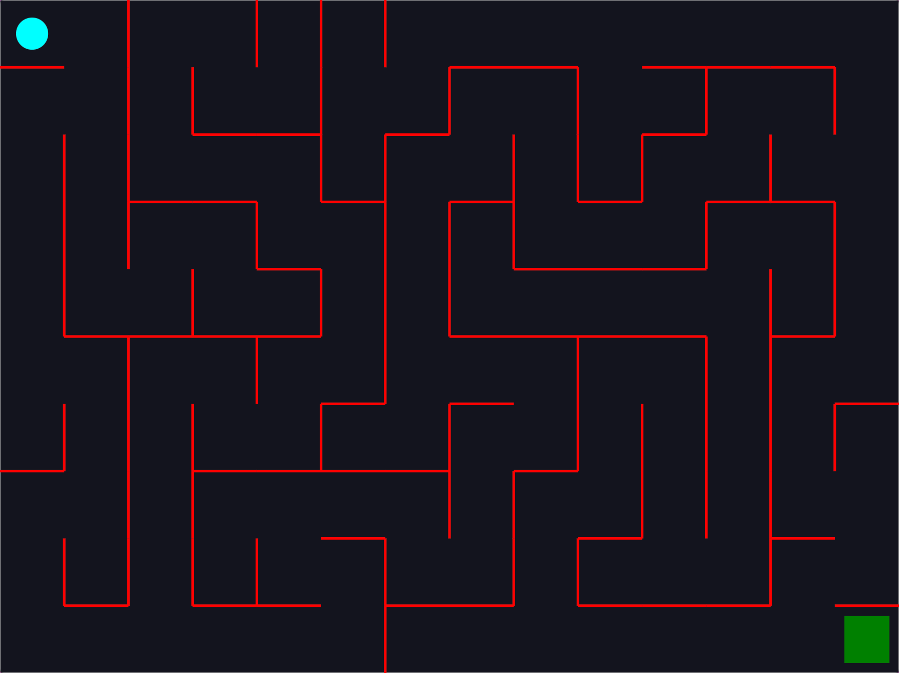

# Maze-JS

A JavaScript-based interactive maze game with procedural generation and physics-based gameplay.

## 🧩 Description

**Maze-JS** is a web application that generates random mazes and challenges players to navigate through them using keyboard controls. The game uses the **Matter.js** physics engine to create a dynamic and responsive environment.

## ✨ Features

- **Procedural Maze Generation** – Every game session creates a unique, randomly generated maze.
- **Physics-Based Gameplay** – Smooth movement and collision detection powered by Matter.js.
- **Keyboard Controls** – Navigate using **Arrow Keys** or **WASD**.
- **Victory Celebration** – When the goal is reached, maze walls collapse dynamically with physics.
- **Responsive Design** – Adapts to various screen sizes and resolutions.

## 🛠️ Technologies Used

- **JavaScript (ES6+)**
- **[Matter.js](https://brm.io/matter-js/)** – 2D physics engine
- **HTML5 & CSS3**
- **[Vite](https://vitejs.dev/)** – Lightning-fast frontend tooling

## 🚀 Live Demo
[](https://app.netlify.com/sites/maze-js1/deploys)

👉 [Click here to play Maze-JS](https://maze-js1.netlify.app)


## 📦 Installation

1. Clone the repository:
   ```bash
   git clone https://github.com/Breedlove-Jason/maze-js.git
   ```
2. Navigate to the project directory:
   ```bash
   cd maze-js
   ```
3. Install dependencies:
   ```bash
   npm install
   ```
4. Start the development server:
   ```bash
   npm run dev
   ```
5. Open your browser and visit: [http://localhost:5173](http://localhost:5173)

## 🎮 How to Play

- Use **WASD** or **Arrow Keys** to move the blue ball through the maze.
- Reach the **green goal** located in the bottom-right corner.
- Upon success, a **victory message** appears and the **maze collapses** with gravity.

## 🧠 Game Mechanics

- The maze is generated using a **depth-first search** (DFS) algorithm.
- The player ball includes physics-based movement (e.g., friction, air resistance).
- Wall collisions are enforced unless an opening exists.
- Ball velocity is capped to avoid passing through walls.

## 📁 Project Structure

```
maze-js/
├── src/
│   ├── main.js        # Core game logic and physics
│   └── style.css      # Game styling
├── index.html         # Main HTML file
├── package.json       # Project configuration
└── README.md          # Project documentation
```

## 🔮 Future Enhancements

- Mobile/touch controls
- Multiple difficulty levels
- Timer and scoring system
- Sound effects and background music
- Additional maze generation algorithms

## 🤝 Contributing

Contributions are welcome!

1. Fork the repository
2. Create a new branch:  
   ```bash
   git checkout -b feature/amazing-feature
   ```
3. Make your changes and commit:  
   ```bash
   git commit -m 'Add some amazing feature'
   ```
4. Push to your fork and submit a Pull Request.

## 📄 License

This project is licensed under the MIT License.

## 👤 Author

**Jason Breedlove**
